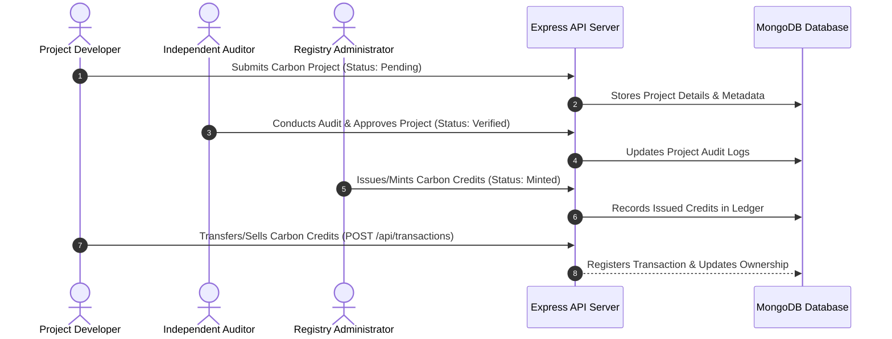

# 🌱 India Carbon Registry - Full-Stack Prototype

A comprehensive, secure, and modern carbon credit registry platform for India. This full-stack prototype enables developers, verifiers, and administrators to register carbon credit projects, conduct audits, issue credits, and trade assets transparently.

[](https://react.dev/)
[](https://nodejs.org/)
[](https://expressjs.com/)
[](https://www.mongodb.com/)
[](https://www.typescriptlang.org/)
[](https://tailwindcss.com/)

---

## 📋 Project Description

The India Carbon Registry is a specialized ecosystem designed to digitize carbon offsets. The platform implements a secure authentication layer, role-based workflows, project application submissions, verifier audits, and a credit trading engine. The application features a robust Node.js backend with Express and MongoDB, and an interactive TypeScript React dashboard for analytics and credit visualization.

---

## 🏗️ System Workflow & Role Lifecycle

The sequence diagram below shows the end-to-end process from project creation to carbon credit trading and retirement:



---

## 🚀 Key Features

### Backend Architecture
*   🔒 **JWT Authentication**: Secured user logins with automatic token expiration and role permissions.
*   📧 **Verification System**: Automated HTML email verification and password reset workflows via Nodemailer.
*   👥 **Role-Based Control**: Separate dashboards and API access for Users, Project Developers, Verifiers, and Registry Admins.
*   🛡️ **API Security**: Implemented rate-limiting (`express-rate-limit`), security headers (`helmet`), and CORS configurations.
*   💾 **Robust DB Integration**: Schemas for users, projects, and transactions managed through Mongoose.

### Frontend Client
*   ⚛️ **React 18 & TypeScript**: Strongly typed components and fast client-side routing.
*   📊 **Analytics Dashboard**: Rich visual metrics, distributions, and credit history plots using Recharts.
*   🎨 **Tailwind CSS & Radix UI**: Accessible, responsive, and beautiful custom user interface components.
*   📝 **Form Validation**: Client-side validation powered by React Hook Form.

---

## 📁 Repository Directory Structure

```text
ai-based-blue-carbon-registry/
├── backend/
│   ├── controllers/      # Route controllers for authentication, projects, and dashboard
│   ├── middleware/       # JWT verification, rate limiter, and role check rules
│   ├── models/          # MongoDB/Mongoose schemas (User.ts, Project.ts, Transaction.ts)
│   ├── routes/          # REST API router endpoints
│   ├── utils/            # Helper functions (email templates, token generator)
│   ├── server.ts         # Main Express app, middleware binding, and DB connection
│   ├── package.json      # Backend npm dependencies
│   └── .env.example      # Example environment variables template
├── src/                  # React Frontend Source Code
│   ├── components/       # Reusable layout panels, buttons, cards, and spinners
│   ├── context/          # Global state managers (AuthContext, ThemeContext)
│   ├── hooks/            # Custom React hooks for API fetching
│   ├── pages/            # View components (Home, Dashboard, Projects, VerifyEmail)
│   ├── styles/           # Global styles and custom Tailwind CSS components
│   └── main.tsx          # Frontend entry mounting element
├── index.html            # Main HTML wrapper
├── tailwind.config.js    # Tailwind configuration setting custom branding colors
├── tsconfig.json         # TypeScript configurations
├── vite.config.ts        # Vite build config with path resolving
└── README.md             # This documentation file
```

---

## ⚙️ Setup & Installation Guide

### Prerequisites
*   [Node.js](https://nodejs.org/) (v18.0.0 or higher).
*   [MongoDB Database](https://www.mongodb.com/cloud/atlas) (local server or cloud Atlas URI).
*   SMTP Server Credentials (e.g. Google Gmail App Password) for sending transactional emails.

### 1. Clone & Install
```bash
# Clone the repository
git clone https://github.com/BGJ06/ai-based-blue-carbon-registry.git
cd ai-based-blue-carbon-registry

# Install dependencies (Vite Root)
npm install

# Install backend dependencies
cd backend
npm install
```

### 2. Configure Environment variables
Create a `.env` file in the `/backend` directory:
```env
NODE_ENV=development
PORT=5000
MONGODB_URI=mongodb://localhost:27017/carbon-registry
JWT_SECRET=your_super_secure_long_jwt_secret_key_here
EMAIL_HOST=smtp.gmail.com
EMAIL_PORT=587
EMAIL_USER=your-email@gmail.com
EMAIL_PASS=your-gmail-app-password
EMAIL_FROM=noreply@carbonregistry.gov.in
FRONTEND_URL=http://localhost:5173
```

### 3. Database Seeding (Optional)
Seed the database with sample carbon credits, developer profiles, and verification logs:
```bash
cd backend
npm run seed
```

### 4. Running the Development Servers

**Start Backend API** (from `/backend` directory):
```bash
npm run dev
```
*Backend runs on `http://localhost:5000`*

**Start Frontend Development server** (from root directory):
```bash
npm run dev
```
*Frontend runs on `http://localhost:5173`*

---

## 🌐 Core API Endpoints

| Category | Endpoint | Method | Description | Access |
| :--- | :--- | :--- | :--- | :--- |
| **Auth** | `/api/auth/register` | `POST` | Registers a new organization or user | Public |
| **Auth** | `/api/auth/login` | `POST` | Log in and receive JWT session token | Public |
| **Auth** | `/api/auth/verify-email` | `POST` | Confirms account via email verification token | Public |
| **Auth** | `/api/auth/me` | `GET` | Retrieve logged-in profile data | User / Admin |
| **Projects**| `/api/projects` | `GET` | List all verified carbon registry projects | Public |
| **Projects**| `/api/projects` | `POST` | Submit a new carbon credit project | Developer |
| **Projects**| `/api/projects/:id` | `PUT` | Edit project metadata | Developer / Admin |
| **Audits** | `/api/projects/:id/verify`| `POST` | Audit and verify project carbon offsets | Verifier |
| **Ledger** | `/api/transactions` | `POST` | Record a carbon credit transfer/trade | Developer / Admin |

---

## 👨‍💻 Developer Credit
This platform was developed and is maintained by:
*   **Mithun Raj T** ([@BGJ06](https://github.com/BGJ06))

---

## 📝 License & Purpose
This project is an open prototype created for the India Carbon Registry. All rights reserved by the development committee.
